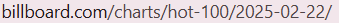
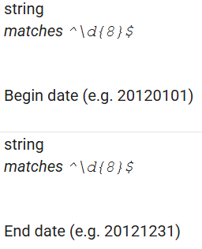
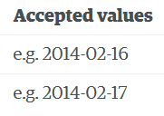
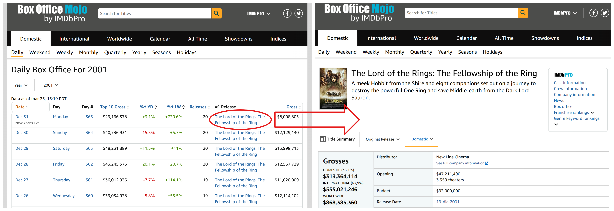
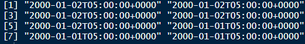
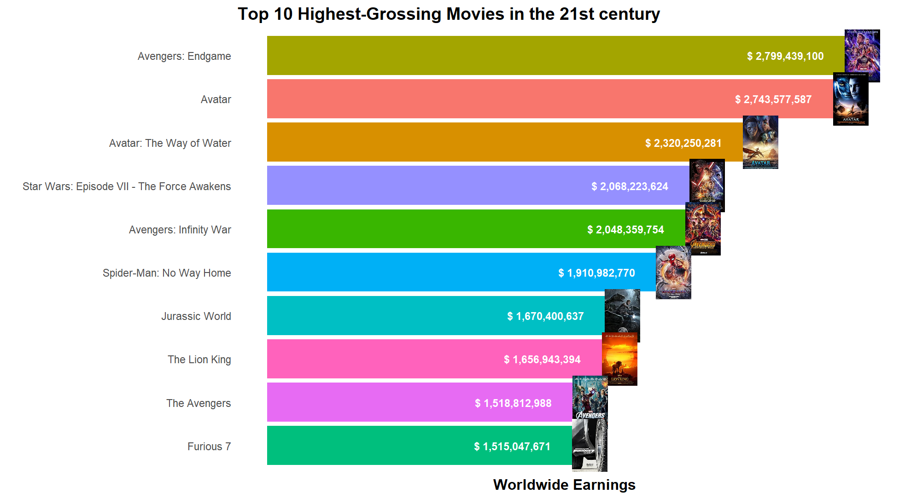
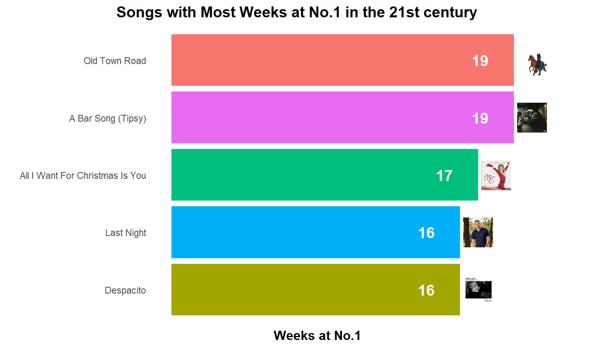

## What do we wanted to get?

::: {.fragment .fade-in data-fragment-index="1" style="text-align: left; margin-top: 10vh;"}
<strong>Goal:</strong> extract curious information about dates in the past
:::

::: {style="display: flex; justify-content: left; align-items: center; margin-top: 5vh; text-align: left;"}
<ul style="list-style-type: disc; padding-left: 50px; margin: 0; line-height: 2.2em">

<li class="fragment fade-in" data-fragment-index="2">

The most profitable movie in the box office: <strong>Box Office Mojo</strong>

</li>

<li class="fragment fade-in" data-fragment-index="3">

The most popular song: <strong>Billboard Hot 100</strong>

</li>

<li class="fragment fade-in" data-fragment-index="4">

The most relevant news: <strong>The New York Times and The Guardian</strong>

</li>

</ul>
:::

::: {.fragment .fade-in data-fragment-index="5" style="text-align: left; margin-top: 5vh;"}
<strong>Method:</strong> 2 scrapers (Billboard & Box Office) + 2 APIs (NYT & The Guardian)
:::

------------------------------------------------------------------------

## General procedure

::: {style="margin-top: 5vh;"}
-   Accessing several years of data by changing the date in the URL or in the API request

-   We created specific functions for each source of data to create date vectors with specific formats and loop over them in our scrapers/API requests
:::

{.absolute top="300" left="0" width="350" height="30"}

{.absolute top="400" left="0" width="350" height="25"}

{.absolute top="300" right="0" width="250" height="250"} {.absolute top="300" right="375" width="200" height="150"}

------------------------------------------------------------------------

## Box Office Mojo scraper

::::: {rows}
::: {.row style="margin-top: 0vh;"}

:::

::: {.row style="position: relative;"}
<ul style="display: flex; list-style-type: none; padding: 0; margin: 0;">

<li style="width: 33%; padding: 0px;">

<ul>

<li>Title</li>

<li>Image of the movie</li>

<li>Date</li>

</ul>

</li>

<li style="width: 33%; padding: 0px;">

<ul>

<li>Daily earnings</li>

<li>Worldwide earnings</li>

<li>Distributor</li>

</ul>

</li>

<li style="width: 33%; padding: 0px;">

<ul>

<li>Genres</li>

<li>Running time</li>

<li>Description</li>

</ul>

</li>

</ul>
:::
:::::

------------------------------------------------------------------------

## Billboard scraper

::::: {rows}
::: {.row style="margin-top: 5vh;"}
Extracting data for the #1 song in each weekly edition of the chart.

<ul style="display: flex; flex-wrap: wrap; list-style-type: none; padding: 0; margin: 0;">

<li style="width: 50%; padding: 10px; box-sizing: border-box;">

<ul>

<li>Name of the song</li>

<li>Artist</li>

<li>Cover image of the song</li>

</ul>

</li>

<li style="width: 50%; padding: 10px; box-sizing: border-box;">

<ul>

<li>Weeks on the chart</li>

<li>Weeks at #1</li>

<li>Last week</li>

</ul>

</li>

</ul>
:::

::: {.row style="margin-top: 5vh;"}
Weekly data needs to be changed to daily data:

```{r}
#| echo: TRUE
#| eval: FALSE

bill <- bill %>%
  complete(date = seq(min(date), max(date), by = "day")) %>%
  fill(-date, .direction = "up") 
```
:::
:::::

------------------------------------------------------------------------

## New York Times and The Guardian APIs

::::::: columns
:::: {.column width="50%"}
::: {style="display: flex; justify-content: left; align-items: center; text-align: left; margin-top: 5vh;"}
<ul style="list-style: none; padding: 0; margin: 0; line-height: 2.2em; max-width: 120vw;">

<li class="fragment fade-in" data-fragment-index="1">

<strong >New York Times</strong>

</li>

<li class="fragment fade-in" data-fragment-index="2">

500 requests per day

</li>

<li class="fragment fade-in" data-fragment-index="3">

5 requests per minute

</li>

<li class="fragment fade-in" data-fragment-index="4">

Up to 10 articles per request

</li>

</ul>
:::
::::

:::: {.column width="50%"}
::: {style="display: flex; justify-content: left; align-items: center; text-align: left; margin-top: 5vh;"}
<ul style="list-style: none; padding: 0; margin: 0; line-height: 2.2em; max-width: 120vw;">

<li class="fragment fade-in" data-fragment-index="1">

<strong >The Guardian</strong>

</li>

<li class="fragment fade-in" data-fragment-index="2">

500 requests per day

</li>

<li class="fragment fade-in" data-fragment-index="3">

60 requests per minute

</li>

<li class="fragment fade-in" data-fragment-index="4">

Up to 50 articles per request

</li>

</ul>
:::
::::
:::::::

::: {.fragment .fade-in data-fragment-index="5" style="text-align: left; margin-top: 10vh;"}
<p>→ Requests over multiple dates to collect more data in a smaller amount of time</p>
:::

::: {.fragment .fade-in data-fragment-index="6" style="text-align: left; margin-top: 5vh;"}
Data about:

<ul style="display: flex; flex-wrap: wrap; list-style-type: none; padding: 0; margin: 0;">

<li style="width: 33%; padding: 10px; box-sizing: border-box;">

<ul>

<li>Headline of the article</li>

</ul>

</li>

<li style="width: 33%; padding: 10px; box-sizing: border-box;">

<ul>

<li>Summary of the article</li>

</ul>

</li>

<li style="width: 33%; padding: 10px; box-sizing: border-box;">

<ul>

<li>URL of the article</li>

</ul>

</li>

</ul>
:::

------------------------------------------------------------------------

## Select the most important news

::: {.fragment .fade-in data-fragment-index="1" style="text-align: left; margin-top: 5vh;"}
<strong>Problem:</strong> Correctly select the most relevant news.

<strong>Solution:</strong> <br>

<ol style="margin-left: 60px;">

<li>Filter for front page articles only or filter for specific sections.</li>

<li>Order articles by relevance.</li>

<li>Group by date and select the most important.</li>

</ol>
:::

::: {.fragment .fade-in data-fragment-index="2" style="text-align: center; margin-top: -2vh;"}


```{r}
#| echo: TRUE
#| eval: FALSE
news <- news |> 
  mutate(date = str_remove_all(date,"T.+$")) |> 
  mutate(date = str_trim(date)) |>     
  mutate(date = as_date(date)) |>  
  mutate(rank = row_number())  |> 
  group_by(date) |> 
  slice_min(rank) |> 
  ungroup() |> 
  select(-rank)
```
:::

------------------------------------------------------------------------

## Most successful movies



------------------------------------------------------------------------

## Most successful songs



------------------------------------------------------------------------

## App

<iframe src="https://davidpereiropol.shinyapps.io/shiny" width="100%" height="500px">

</iframe>
